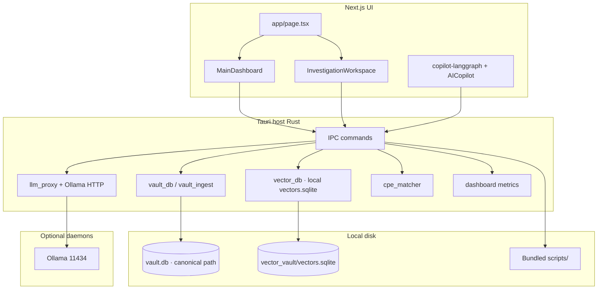

# CTI Command Center

**CTI Command Center** is a desktop-first **cyber threat intelligence (CTI)** workspace: a **Tauri 2** shell hosts a **Next.js 16** UI, while **Rust** owns the SQLite vault, **embedded local** semantic vector storage (SQLite under app data, no separate vector server), **Ollama**-backed copilot flows, and safe **Tauri IPC** to local services (no direct `fetch()` from the WebView to loopback for core CTI operations).

---

## Table of contents

- [Features](#features)
- [Architecture](#architecture)
- [Prerequisites](#prerequisites)
- [Quick start](#quick-start)
- [Development](#development)
- [Production build](#production-build)
- [Workspace & data model](#workspace--data-model)
- [Optional local services](#optional-local-services)
- [Tauri IPC commands](#tauri-ipc-commands)
- [Environment variables](#environment-variables)
- [Python feature projects](#python-feature-projects)
- [Headless CLI (Rust)](#headless-cli-rust)
- [Packaging notes](#packaging-notes)
- [Security](#security)
- [Repository layout](#repository-layout)
- [Further reading](#further-reading)

---

## Features

| Area | Description |
|------|-------------|
| **Vault** | Single SQLite file at an **absolute** path from `vault_db::get_vault_path` (`CTI_DB_PATH`, default under OS app data e.g. macOS `~/Library/Application Support/<bundle-id>/cti-app/cti_vault.db`): IOC records, CVE data, ASM assets, etc. Migrations and WAL in Rust (`vault_db`). |
| **Parameterized search** | `search_vault` — fixed SQL templates only; filters from the UI are bound as parameters (no raw SQL from the client). |
| **Semantic IOC search** | Embeddings via **Ollama** (`/api/embeddings`, default `nomic-embed-text`), vectors in a **local SQLite** store (`threat_intel` table in `vector_vault/vectors.sqlite`), hydration from the vault. Command: `semantic_threat_search`. |
| **Investigation Copilot** | **LangGraph**-style flow in TypeScript: route query → semantic / structured vault tools → synthesis; Ollama chat proxied through **`invoke_local_llm`** (host `reqwest`). |
| **Dashboard** | Main page metrics over IPC: total IOCs, distinct assets in `asset_cve_mapping`, local vector store health (`get_dashboard_metrics`). |
| **Asset ↔ CVE correlation** | `cpe_matcher` + `run_asset_cve_correlation` + scheduled job: CPE / keyword matching between `asm_assets` and `cve_data`. |
| **Graph pivot** | One-hop IOC graph from the vault (`get_pivot_graph`). |
| **Feature runners** | Run bundled Python/sh projects with workspace env injection (`run_feature_v2`, `run_project_script`). |
| **CSV bridge** | Post-run sync into the vault via `ingest_csv_vault` / `shared_utils/ingestor.py`. |

---

## Architecture



- **UI** talks to **Rust only** through `@tauri-apps/api` `invoke` for vault, vectors, LLM proxy, dashboard, etc.
- **Ollama** is reached from the **Rust process** for chat and embeddings; vectors stay on disk in the host’s app data tree. The WebView does not open arbitrary loopback `fetch` for production-critical CTI paths.

---

## Prerequisites

| Tool | Notes |
|------|--------|
| **Node.js** | LTS recommended; matches Next 16 / React 19 toolchain. |
| **Rust** | `rust-version` in `src-tauri/Cargo.toml` (currently **1.88+**). Install via [rustup](https://rustup.rs/). |
| **Platform kits** | Follow [Tauri prerequisites](https://v2.tauri.app/start/prerequisites/) (WebView2 on Windows, GTK/WebKit on Linux, Xcode CLTs on macOS). |
| **Python 3** | Host `python3` / `python` for feature venvs (not embedded in the app binary). |
| **Ollama** (optional) | For LLM + embeddings; default `http://127.0.0.1:11434`. |

---

## Quick start

```bash
# Install JS dependencies
npm install

# UI only (browser) — limited without Tauri IPC
npm run dev
```

**Full desktop app** (Next dev server + Tauri WebView):

```bash
npm run tauri dev
```

On first launch, the app creates an app-data layout (see `cti_config`) and mirrors the resolved **`vault_db_path`** in `config.json` (same value as `vault_db::get_vault_path()`).

---

## Development

| Script | Purpose |
|--------|---------|
| `npm run dev` | Next.js dev server (default port **3000**). |
| `npm run build` | Production Next build → `out/` (used as `frontendDist` for Tauri). |
| `npm run build:python` | PyInstaller ingestion sidecars → `src-tauri/binaries/` (Rust-style triple suffix; see **`build-sidecars.js`**). Use a project **`.venv`** with PyInstaller + script `requirements.txt` installed. |
| `npm run lint` | ESLint. |
| `npm run tauri dev` | Tauri dev with `beforeDevCommand: npm run dev`. |
| `npm run tauri:build` | **`build:python`** then **`tauri build`** — use this for release bundles that embed frozen Python binaries (`bundle.externalBin`). |
| `npm run tauri build` | Same as **`tauri`** CLI only (does not run **`build:python`**). |

**Next.js:** This repo targets **Next.js 16**; APIs and conventions may differ from older Next docs. Prefer `node_modules/next/dist/docs/` when unsure.

**Rust:**

```bash
cd src-tauri && cargo build
cargo test   # if/when tests are added
```

---

## Production build

```bash
npm run tauri:build
```

For a bundle **without** rebuilding PyInstaller sidecars (only if `src-tauri/binaries/` already has the correct host triple artifacts), you can run `npm run tauri build`.

Artifacts land under `src-tauri/target/release/bundle/` (platform-specific: `.app`, `.dmg`, `.msi`, `.deb`, etc., per `bundle.targets`).

Bundled resources include:

- `resources/scripts/**/*` → `scripts/` in the app bundle  
- `resources/sqlite_extensions/**/*` → `sqlite_extensions/` (optional loadable SQLite extensions; see `build.rs` rerun hints)

macOS uses **`entitlements/macos/production.entitlements.plist`** and merges **`Info.plist`** for local-network usage strings. CSP and `connect-src` are defined in **`tauri.conf.json`** for controlled WebView access.

---

## Workspace & data model

- A **workspace** is a directory (often your monorepo root or a dedicated CTI folder) that contains feature project folders (e.g. `CVE_Project_NVD`, `ASM-fetch-main`, `IOCs-crawler-main`, …). The **SQLite vault file** is not workspace-relative: Rust always opens `vault_db::get_vault_path()`.

**Canonical tables** (see `vault_db.rs`, migrations under `src-tauri/resources/migrations/`):

- `ioc_records`, `ioc_news`, `cve_data`, `asm_assets`, `vault_meta`, …
- **`asset_cve_mapping`** — created by `cpe_matcher`; correlates `asset_target` ↔ `cve_id` when CPE / keyword logic matches.

The app opens SQLite with **WAL**, **busy timeout**, and **foreign keys** where applicable.

---

## Optional local services

| Service | Default | Purpose |
|---------|---------|---------|
| **Ollama** | `OLLAMA_HOST` → `http://127.0.0.1:11434` | Chat + `/api/embeddings` (`OLLAMA_EMBED_MODEL`, default `nomic-embed-text`). |
| **RethinkDB** | `.env` / workspace (e.g. `RTK_HOST`, `RTK_PORT`) | Used by IOC export scripts (`IOCs-crawler-main`) when pushing news → vault paths. |

Semantic vectors are stored in **`vector_vault/vectors.sqlite`** under the app’s writable root (see `cti_config`); no separate vector database process is required.

---

## Tauri IPC commands

Invoked from the frontend as `invoke("<command>", { ... })` (camelCase args match serde on the Rust side).

| Command | Summary |
|---------|---------|
| `validate_workspace` | Checks expected project folders under a path. |
| `validate_features_bundle` | Verifies bundled `scripts/` feature dirs from app resources. |
| `get_dashboard_metrics` | `{ workspacePath }` → IOC count, vulnerable asset count, local vector store status payload. |
| `search_vault` | Parameterized vault query (`vault_search::SearchParams`). |
| `get_pivot_graph` | `{ iocId }` + app config vault path → pivot graph JSON. |
| `run_project_script` | Stream/run a project script (legacy path). |
| `run_feature_v2` | Run a named feature with JSON arguments. |
| `cti_bootstrap` | Initialize writable tree + default config. |
| `resolve_feature_path` | Resolve bundled feature directory. |
| `feature_status` | Feature layout / venv status. |
| `bootstrap_feature_venv` | Create one feature venv under AppData. |
| `bootstrap_all_feature_venvs` | Best-effort all features. |
| `ingest_cve_vault` | Ingest CVE workspace exports into `cve_data`. |
| `ingest_asm_vault` | ASM → vault (Postgres script or CSV fallback). |
| `ingest_iocs_vault` | IOC export / refresh paths. |
| `ingest_csv_vault` | Run CSV → vault sync (`ingestor.py`). |
| `run_asset_cve_correlation` | Run CPE / keyword matching job; returns inserted row count. |
| `start_background_scheduler` | Cron-style jobs (CVE refresh, IOC news, daily CPE match, …). |
| `invoke_local_llm` | Proxy to Ollama `/api/chat` (messages, tools, model, host). |
| `semantic_threat_search` | Embed query + local vector top-5 + SQLite hydrate (`vector_db`). |

`llm_proxy::invoke_local_llm` is registered under the name **`invoke_local_llm`**.

---

## Environment variables

| Variable | Used by | Purpose |
|----------|---------|---------|
| `OLLAMA_HOST` | `vector_db`, `llm_proxy` | Ollama HTTP base. |
| `OLLAMA_EMBED_MODEL` | `vector_db` | Embedding model id (default `nomic-embed-text`). |
| `CTI_DB_PATH` | `vault_db`, headless CLI, child processes | Absolute vault path; when unset, defaults under OS app data (e.g. macOS `~/Library/Application Support/com.pamu512.crispyumbrella/cti-app/`, same layout as Tauri `app_data_dir`). Override `CTI_COMMAND_CENTER_HOME` for a custom data directory. |
| `CTI_WORKSPACE_PATH` | Python / ingest | Workspace root for scripts. |
| `CTI_WRITABLE_ROOT` / `CTI_EXPORTS_DIR` | Injected by host | AppData layout for exports/logs (see `cti_config` / `lib.rs`). |

Feature-specific `.env` files under the workspace may supply RethinkDB hosts, etc.

---

## Python feature projects

Bundled layout is described in **`src-tauri/resources/scripts/README.txt`**:

- Ship folders such as `Intelx_Crawler`, `CVE_Project_NVD`, `ASM-fetch-main`, … under `resources/scripts/` (or set **`resourceScriptsFallback`** in `cti-app/config.json` for dev).
- The app **does not embed CPython**; it creates per-feature **venvs** under `%APPDATA%/…/cti-app/python_env/` using the host interpreter.
- Shared DB access from Python: **`shared_utils/db_manager.py`** with `CTI_DB_PATH` aligned to the Rust vault.

Optional **PyOxidizer** layout for a single-file ML sidecar lives under **`packaging/pyoxidizer-ml/pyoxidizer.bzl`** (invoke with the PyOxidizer CLI when you need a frozen Python binary).

---

## Headless CLI (Rust)

The library exposes **`run_headless_cli`** for automation (CSV ingest, etc.) without opening a window. See `lib.rs` for flags: optional `--vault` / **`CTI_DB_PATH`**, else the same default as `vault_db::get_vault_path()`.

---

## Packaging notes

- **`src-tauri/tauri.conf.json`** — product id, CSP, `bundle.resources`, macOS entitlements / `Info.plist` merge, Linux `.deb` dependencies (WebKit, SQLite, SSL, …), Windows WebView2 bootstrapper settings.
- **`src-tauri/build.rs`** — Reruns build when config / capabilities / entitlements / optional SQLite extension tree change; sets `CTI_SQLITE_EXTENSIONS_BUNDLE_SUBDIR` when extensions directory exists.
- **`src-tauri/capabilities/default.json`** — Core, store, dialog, fs, log permissions for the WebView.

---

## Security

- Prefer **IPC + Rust** for secrets and loopback HTTP to Ollama.
- **CSP** restricts `connect-src` and related directives (see `tauri.conf.json`); dev CSP additionally allows the Next dev origin.
- **Vault SQL** is not composed from raw user strings in IPC handlers; use `search_vault` filters or dedicated commands.

---

## Repository layout

```
├── src/                      # Next.js App Router UI
│   ├── app/                  # Routes (e.g. page.tsx)
│   ├── components/           # React components (workspace, dashboard, copilot, …)
│   └── lib/                  # TS helpers (vault-search, copilot-langgraph, …)
├── src-tauri/                # Tauri + Rust
│   ├── src/                  # lib.rs, vault_*, vector_db, cpe_matcher, dashboard, …
│   ├── resources/            # scripts/, sqlite_extensions/, migrations/
│   ├── capabilities/
│   ├── entitlements/
│   ├── tauri.conf.json
│   └── Cargo.toml
├── packaging/pyoxidizer-ml/  # Optional frozen Python (PyOxidizer)
├── package.json
├── AGENTS.md                 # Agent note: Next.js version quirks
└── README.md                 # This file
```

---

## Further reading

- [Tauri 2 documentation](https://v2.tauri.app/)
- [Next.js documentation](https://nextjs.org/docs) (verify version-specific behavior for **16.x**)
- Internal: `src-tauri/resources/scripts/README.txt`, `CLAUDE.md` / `AGENTS.md`

---

## License

Specify your license in `src-tauri/Cargo.toml` and this README when you publish the project.
