# CTI function map (All_Scripts)

This document maps each folder and top-level helper to **CTI-style functions**: what part of a typical intelligence workflow it supports. It is **descriptive** (what the code is *for*), not a claim that every tool is a full TIP or SOC platform.

**CTI function legend**

| Function            | Meaning here                                                                                          |
| ------------------- | ----------------------------------------------------------------------------------------------------- |
| **Collection**      | Ingesting data from the web, APIs, or feeds (OSINT, commercial, community).                           |
| **Tactical**        | Short-lived, detection-oriented artifacts (IOCs, indicators) when the tool produces or supports them. |
| **Operational**     | Campaign/actor/ecosystem context (TTPs, victim sets, “what’s active”).                                |
| **Strategic**       | Long-horizon trends, planning, high-level risk (light touch in this repo).                            |
| **Vulnerability**   | CVE/NVD/KEV/exploitability-style intelligence.                                                        |
| **Attack surface**  | Internet/exposure and asset discovery (often CTI-adjacent, defensively focused).                      |
| **Brand / fraud**   | Phishing, impersonation, social abuse, business risk.                                                 |
| **Exposure / leak** | Breach-style or credential/leak data (legal/ToS sensitive).                                           |
| **Enrichment**      | Adding context to an observable (third-party lookups).                                                |
| **Dissemination**   | Exporting to analysts, DBs, or other tools (CSVs, APIs, not full TIP in most cases).                  |

---

## Visual map (projects → functions)

```mermaid
flowchart TB
  subgraph C["CTI functions"]
    COL[Collection]
    TAC[Tactical / IOCs]
    OPE[Operational / situational]
    STR[Strategic]
    VUL[Vulnerability]
    ASM[Attack surface]
    BRA[Brand / fraud]
    EXP[Exposure / leak]
    ENR[Enrichment]
    DIS[Dissemination]
  end

  ASMfetch[ASM-fetch-main]
  CVE[CVE_Project_NVD]
  Mac[Compromised_user_Mac]
  IOC[IOCs-crawler-main]
  IX[Intelx_Crawler]
  Brand[Phishing_and_Social_Media_All-in-one]
  Rwl[Ransomware_live_event_victim]
  Soc[Social_MediaV2]
  SCTI[shared_cti]

  ASMfetch --> COL
  ASMfetch --> ASM
  ASMfetch --> DIS

  CVE --> VUL
  CVE --> COL
  CVE --> DIS

  Mac --> EXP
  Mac --> COL
  Mac --> DIS

  IOC --> COL
  IOC --> TAC
  IOC --> OPE
  IOC --> DIS

  IX --> EXP
  IX --> COL
  IX --> TAC
  IX --> DIS

  Brand --> BRA
  Brand --> COL
  Brand --> DIS

  Rwl --> COL
  Rwl --> OPE
  Rwl --> DIS

  Soc --> BRA
  Soc --> COL
  Soc --> DIS

  SCTI --> ENR
  SCTI --> TAC
```

Dashed or weak links to **strategic** analysis: none of these projects are *primarily* strategic assessment engines; they mostly **collect, transform, and export**.

---

## Table: each application folder

| Folder                                   | Primary CTI functions                               | Secondary / how it shows up                                                                                                             |
| ---------------------------------------- | --------------------------------------------------- | --------------------------------------------------------------------------------------------------------------------------------------- |
| **ASM-fetch-main**                       | Attack surface, Collection                          | Shodan / SecurityTrails / FOFA–style **discovery**; subdomains, services, some CVE/port context. Supports **defensive** prioritization. |
| **CVE_Project_NVD**                      | Vulnerability, Collection                           | NVD, KEV, OT-related flows; **CVE** search, combine, verify.                                                                            |
| **Compromised_user_Mac**                 | Exposure / leak, Collection                         | Tor to **.onion** “logs” marketplace; **cookie** + scrape → **CSV** (fraud / account-risk angle).                                       |
| **IOCs-crawler-main**                    | Collection, Operational (early warning)             | **News/blog/RSS** scrapers; can feed **tactical** work if you extract IOCs from text. Situational awareness.                            |
| **Intelx_Crawler**                       | Exposure / leak, Collection, Tactical (conditional) | **Intelligence X** API: leak-style **search**; optional **PII/credential** pipelines → **CSVs**.                                        |
| **Phishing_and_Social_Media_All-in-one** | Brand / fraud, Collection                           | **Brand Scout**: permutations, **WHOIS/DNS**, **social** surfaces, **screenshots**.                                                     |
| **Ransomware_live_event_victim**         | Collection, Operational                             | **Ransomware.live PRO API**: **victims** and **press/cyber** events → **CSVs**; landscape / victimology.                                |
| **Social_MediaV2**                       | Brand / fraud, Collection                           | **Tor**-proxied **search** + **social** results + **Playwright** screenshots.                                                           |

---

## Top-level / shared scripts (not full apps)

| Item                                  | CTI functions                        | Notes                                                                                                    |
| ------------------------------------- | ------------------------------------ | -------------------------------------------------------------------------------------------------------- |
| `**run.sh` / `scripts/venv_run.sh`**  | *(none — tooling)*                   | Runs other projects; not intelligence itself.                                                            |
| `**scripts/bacongris_smoke_test.py`** | *(none — test)*                      | Dummy JSON for pipeline tests.                                                                           |
| `**shared_cti/`**                     | Enrichment, Tactical (if integrated) | Optional **MISP** search, **VirusTotal**, **TAXII** sketches via env vars; you **wire** into a workflow. |
| `**README.txt`**                      | *(none — documentation)*             | How to run projects.                                                                                     |

---

## Gaps (what is *not* covered as a system)

- **No built-in** OTX / MISP / OpenCTI **feed config** (e.g. `ftype`, `api_key_ref`, `poll_interval_minutes`) in this repo.
- **No** full **TIP**: scoring, case management, STIX graph, team workflows—mostly **collect → store/export**.
- **Strategic** production (formal written assessments) is **out of scope** of these scripts.

**See also:** `CTI_TEAM_USAGE_AND_WORKFLOWS.md` — how CTI teams use the scripts, roles, and mapped workflows (Mermaid).  
**IntelX (leak search):** `INTELX_LEAK_CHECK_WORKFLOW.md` and `AGENTS.md` — use `Intelx_Crawler` / `./run.sh Intelx_Crawler`, not `add_feed` placeholders.  
**All script runbooks:** `SCRIPT_WORKFLOWS.md`.

For questions or changes, edit this file next to the code you care about.