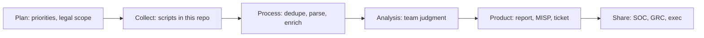
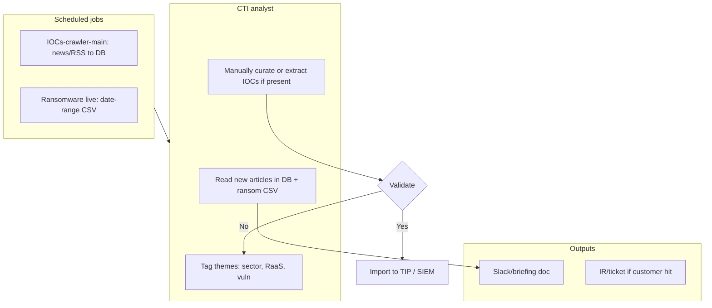
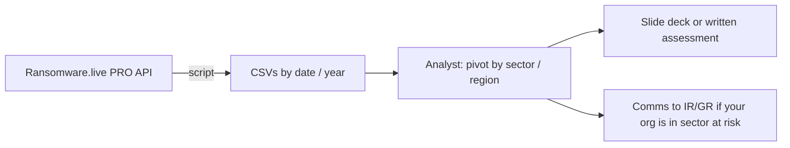
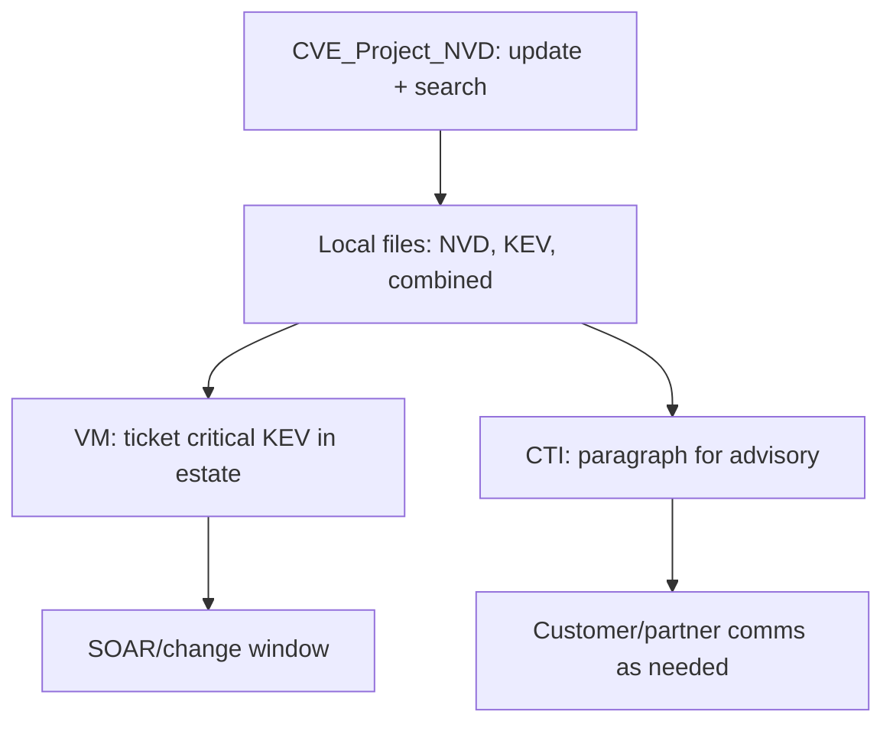
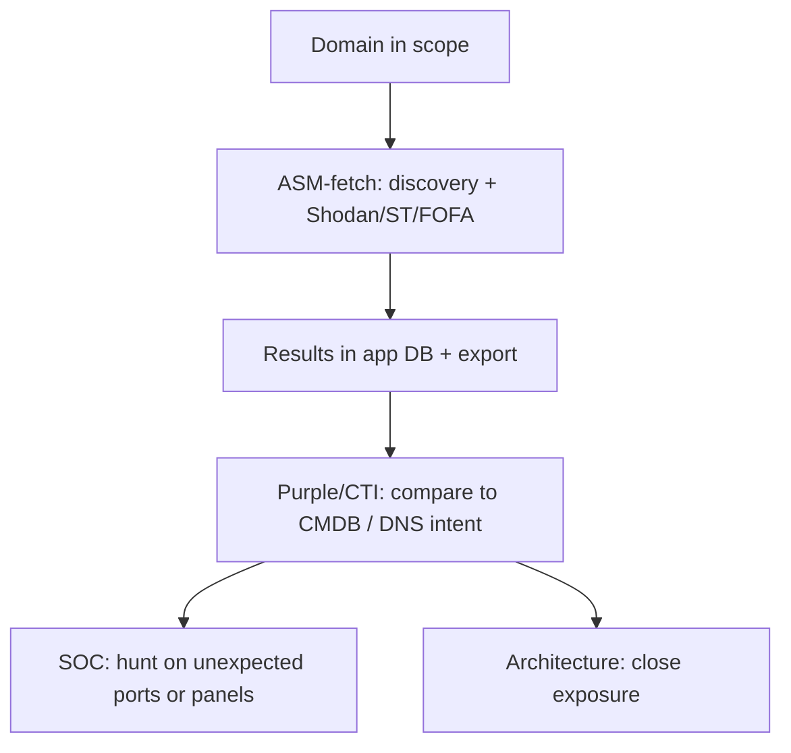
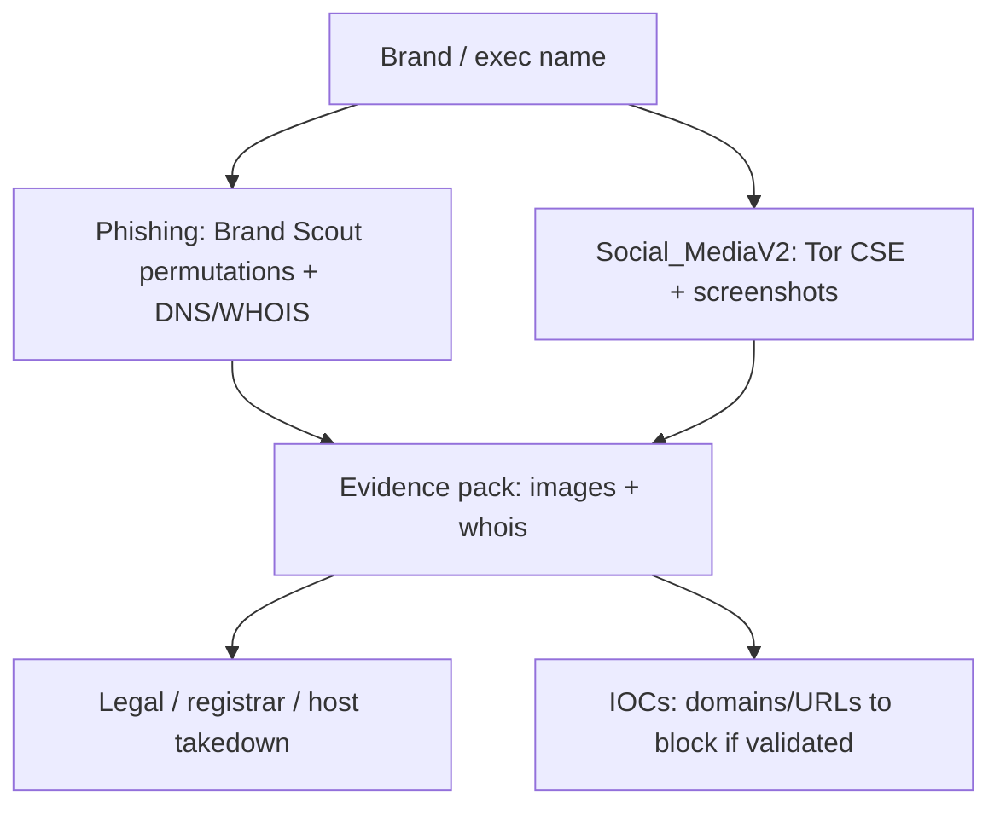
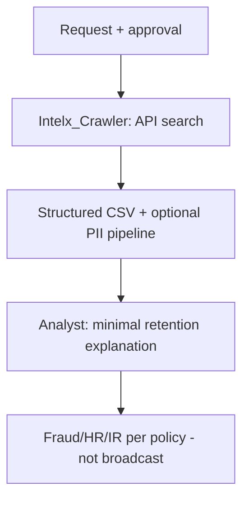
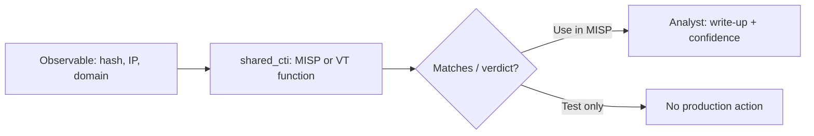

# How a CTI team would use these scripts (detailed + workflows)

This document explains **how different CTI functions** (people and processes) would **operateally** use the **All_Scripts** projects: **inputs, outputs, handoffs, and mapped workflows**. It assumes the team has **legal review** for OSINT, leak-style tools, and Tor use where applicable.

**Scope reminder:** These scripts are mostly **collect → transform → export** (CSVs, DBs, APIs). They are **not** a full TIP (threat intelligence platform) with case management, STIX-native lifecycle, or built-in OTX/MISP/OpenCTI poller configs. Teams typically **insert** the outputs into their existing stack (MISP, SIEM, reports, tickets).

---

## 1. How this collection fits a CTI program

| CTI program need                                                      | Filled by these scripts?                                                                              | Typical team action                                                                    |
| --------------------------------------------------------------------- | ----------------------------------------------------------------------------------------------------- | -------------------------------------------------------------------------------------- |
| **Situational awareness** (what is being discussed / who is hit)      | **Partially** — news crawlers, ransomware API, social/brand                                           | Daily/weekly review of exports; feed into briefings.                                   |
| **Tactical IOCs** (block, detect, hunt)                               | **Partially** — only where IOCs appear in tool output or after **manual extraction** from news/IntelX | Import to TIP/SIEM after validation; use `shared_cti` for VT/MISP checks.              |
| **Operational** (campaigns, victimology, crimeware trends)            | **Partially** — ransomware exports, some news context                                                 | Support incident leadership and leadership reporting.                                  |
| **Vulnerability** intel                                               | **Yes, for CVE/NVD/KEV/OT-style workflows**                                                           | Patch prioritization, KEV triage, OT exposure discussions.                             |
| **Attack-surface** / **exposure** (what we look like on the internet) | **Yes, ASM-fetch**                                                                                    | Purple-team, VM, and architecture conversations (not the same as “threat actor TTPs”). |
| **Brand / executive risk** (phishing, impersonation)                  | **Yes, Brand Scout + Social_MediaV2**                                                                 | Comms, legal, customer trust, takedown workflows.                                      |
| **Breach / leak / cred exposure**                                     | **Yes, with heavy governance** — IntelX, Compromised_user_Mac                                         | Fraud, ATO, sometimes IR—**not** for unfettered “monitoring employees.”                |
| **Strategic** assessments (multi-month trends, geo, policy)           | **Minimal** — no dedicated strategic production engine                                                | Analysts still write; scripts supply **data points** only.                             |

---

## 2. Roles: who touches which folder

| Role / function                                            | Primary folders                                                        | What they do with them                                                                                                          |
| ---------------------------------------------------------- | ---------------------------------------------------------------------- | ------------------------------------------------------------------------------------------------------------------------------- |
| **CTI analyst (general)**                                  | `IOCs-crawler-main`, `Ransomware_live_event_victim`, `CVE_Project_NVD` | Read outputs; build timeline; **extract** IOCs and facts for reports; brief SOC with validated indicators.                      |
| **SOC / detection engineer** (handoff)                     | `CVE_Project_NVD` (KEV), outputs from news/IntelX after parsing        | Turn validated IOCs into **rules**; KEV for **emergency patch** comms.                                                          |
| **Vulnerability management / VM**                          | `CVE_Project_NVD`, `ASM-fetch-main` (if CVE/port context is used)      | **Prioritize** CVEs; **correlate** with KEV; ASM helps **exposed services** (different from CVSS alone).                        |
| **Attack-surface / purple / architecture**                 | `ASM-fetch-main`                                                       | **Subdomain and service** inventory; what Shodan/ST/FOFA see; supports **hardening** and **exposure** narrative for leadership. |
| **Brand / fraud / trust & safety**                         | `Phishing_and_Social_Media_All-in-one`, `Social_MediaV2`               | **Phish kits**, look-alike domains, **social** abuse; **screenshots** for takedown packages and exec updates.                   |
| **Financial crime / ATO / fraud intel** (where authorized) | `Intelx_Crawler`, `Compromised_user_Mac`                               | **Leak** and **stolen log** **research**; **very** policy-heavy; often paired with **fraud ops**, not open CTI.                 |
| **Ransomware / crimeware focus**                           | `Ransomware_live_event_victim`                                         | **Victim lists**, event timelines for **situational** and **geopolitical** context (as far as the API data goes).               |
| **Platform / automation engineer**                         | `run.sh`, all projects, `shared_cti`                                   | **Schedule** jobs, **inject** API keys, **land** output in S3/DB, **connect** to MISP/SIEM.                                     |

No single role “owns” every script; **governance** (who may run Tor, IntelX, or marketplace scrapers) should be explicit.

---

## 3. Per-script: how a CTI team uses it (inputs → actions → outputs)

### 3.1 `ASM-fetch-main` (external attack surface)

- **CTI use:** **Attack-surface and exposure** intelligence, **defensive** storytelling (“what the internet sees”), **not** a substitute for full actor-TTP analysis.
- **Typical users:** CTI supporting **hardening**, **purple team**, **CISO** briefings, sometimes **BCDR** when paired with “what is exposed if DNS misconfigured.”
- **Inputs:** Domain(s) to scan, API keys (Shodan, SecurityTrails, FOFA as configured in your deployment), **Docker/compose** for full stack in many setups.
- **Actions:** Run discovery jobs; review **subdomains**, **IPs**, **open ports**, **Shodan-attributed CVE/service** data where implemented.
- **Outputs:** **Persisted in app DB** + **export** paths per your `README` (API/CSV). Hand off **prioritized** exposure lists to **VM** and **SOC** (unusual open admin panels, etc.).

### 3.2 `CVE_Project_NVD`

- **CTI use:** **Vulnerability** intelligence—**NVD**, **CISA KEV**, **OT**-related data; supports **patch urgency** and **narrative** for leadership (“this CVE is in KEV”).
- **Typical users:** Vuln CTI, VM, **SOC** for KEV, **OT** security where relevant.
- **Inputs:** Local **update vs search** modes (see project `README`); may need **Tor** for some fetches in your version.
- **Actions:** **Refresh** feeds, **search** by product/CVE, **combine** datasets, **verify** dates in files.
- **Outputs:** **CSV/JSON**-style local files; feed into your **GRC/VM** tool or **Jira** after manual or scripted ETL.

### 3.3 `Compromised_user_Mac`

- **CTI use:** **Exposure / crimeware marketplace** “what’s for sale” style **OSINT**—**high risk** and **jurisdiction** sensitive. Often used by **fraud** or **specialized** CTI, not by every analyst.
- **Typical users:** **Fraud intel** or **dedicated** dark-web analysts with process.
- **Inputs:** **Tor** access, a valid **session cookie** for the target .onion, paths from `main.py`.
- **Actions:** Scrape **logs listings**; normalize dates/sizes; save **CSV**.
- **Outputs:** **CSV** for follow-up: **victim** notification workflows (if legal), **credential reset** campaigns, or **threat** reporting on *which verticals* appear in logs—**not** to paste raw PII in chat.

### 3.4 `IOCs-crawler-main`

- **CTI use:** **Collection** for **situational awareness** and **early** mention of TTPs/vulns/actors; **raw** for **IOCs** if you **parse** article bodies.
- **Typical users:** **CTI** daily triage, **vuln** comms, **strategic** briefs (when aggregated over weeks).
- **Inputs:** **Celery/Redis** (or your deployment), RethinkDB, **scheduler**; enable/disable **per-source** modules in `news_job.py`.
- **Actions:** Schedule **RSS/HTML** fetches; dedupe; store in DB.
- **Outputs:** **Database** of articles; CTI **reads**, **tags**, **exports** excerpts; **IOC extractors** (separate) may run on the text. Hand to **report** writers and, after validation, to **MISP** manually or via a **custom** connector.

### 3.5 `Intelx_Crawler`

- **CTI use:** **Leak/breach**-style and **pasted** data **retrieval** via **Intelligence X**; supports **breach** narrative, **ATO** research, and **fraud**—**contractual** and **ToS** bound.
- **Typical users:** CTI in **BEC/ATO** programs, **insider** risk (careful), **M&A** diligence in some orgs; **not** a general “dox” tool.
- **Inputs:** **Intelligence X** API key, **targets** (emails, domains, IPs, etc.), **date** windows, **limits** in `main.py`.
- **Actions:** **Search**, **paginate** results, optional **file** views; PII/credential **pipelines** in repo—governed use only.
- **Outputs:** **CSVs** and **reports** for **closed** channels; may feed **internal** “this email appeared in a paste” **tickets**—rarely raw export to open MISP.
- **Runbook (operators & assistants):** `**SCRIPT_WORKFLOWS.md` §6** and `**INTELX_LEAK_CHECK_WORKFLOW.md`** — exact commands (`./run.sh Intelx_Crawler`), what **not** to use (`add_feed` / fake IntelX URLs), and API base `https://2.intelx.io`. `**AGENTS.md`** tells automation to route IntelX questions there.

### 3.6 `Phishing_and_Social_Media_All-in-one` (Brand Scout)

- **CTI use:** **Brand and fraud** CTI: **typosquat**, phish, **impersonation**, **social** misuse.
- **Typical users:** **Brand protection**, **CTI** working with **legal** and **customer trust**, **BEC** teams.
- **Inputs:** **Brand** string(s), **Docker** env, any API keys the stack requires.
- **Actions:** **Permutation** generation, **WHOIS/DNS** checks, **social** search, **screenshots** for takedown evidence.
- **Outputs:** **Images + structured** outputs for **tickets**; **C-suite**-safe slides; may inform **phishing** **IOC** (domains/URLs) after validation for **blocklists**.

### 3.7 `Ransomware_live_event_victim`

- **CTI use:** **Operational** crimeware **situational** awareness: **victims**, **press/cyber** events, **victimology** over a **date range**.
- **Typical users:** **CTI** covering **crimeware**, **GR**-style “who is in the press,” **IR** for **geography/sector** trends.
- **Inputs:** **Ransomware.live PRO** API key in `.env`, **Docker** or local run, **date range** interactive.
- **Actions:** Export **year** or **range** **CSVs**; filter for **industry/region** in Excel or a DB.
- **Outputs:** **CSVs** → **briefings** (“trend this week”); if the API includes **IOCs** in the row set, may feed **TIP** with validation. Often **complements** (not replaces) your **ISAC** and **insurance** data.

### 3.8 `Social_MediaV2`

- **CTI use:** **OSINT** on **public** (or CSE-captured) **social** mentions, **reputation** and **abuse**; **low** for technical IOCs unless links appear in output.
- **Typical users:** **Brand/executive** protection, **disinformation** adjacent teams (process-dependent).
- **Inputs:** **Target** name, **Tor** in path, **Docker** script args, time windows.
- **Actions:** **Search** + **scrape** + **Playwright** screenshots.
- **Outputs:** **CSVs** + **images** for **narrative** evidence; can **trigger** takedown or comms. Rarely a primary **tactical** feed for SOC.

### 3.9 `shared_cti/`

- **CTI use:** **Enrichment** and **Tactical validation** if you call **MISP** `restSearch`, **VirusTotal** file report, or **TAXII** (with `taxii2-client` installed). Bridges **ad-hoc** from analyst notebook or a **wrapper** job.
- **Typical users:** **Analysts** and **automation** engineers.
- **Not** a replacement for a **formal TIP** connector; **orchestration** and **key rotation** are on you.

---

## 4. Workflows (mapped)

The diagrams use **Mermaid** (view in GitHub, VS Code, or any Markdown preview). Solid boxes are **human steps**; scripts are in **round** or labeled nodes.

### 4.1 High-level: where scripts sit in an intelligence process

A minimal **plan → collect → process → analyze → produce → share** view:

**Collect** examples: ASM-fetch, CVE tools, IOCs-crawler, Ransomware export, IntelX, Brand tools, Tor-related scripts. **Process** may use `shared_cti` (VT, MISP, TAXII) and your parsers. These scripts are **heaviest** on **Collect**; **light** on **Process/Analyze/Produce** (your team and tools do that).

---

### 4.2 Daily CTI “morning read” (situational + vuln + ransom)

**Goal:** same-day awareness for **leadership** and **SOC** prep.

**Who:** CTI analyst. **Cadence:** daily. **Key scripts:** `IOCs-crawler-main`, `Ransomware_live_event_victim`.

---

### 4.3 Ransomware landscape and victimology (weekly–monthly)

**Goal:** “Who is in the data, in which sectors, what does the **press** say” for **GRC** and **exec**.

**Who:** crimeware-focused CTI, sometimes **IR liaison**. **Script:** `Ransomware_live_event_victim`.

---

### 4.4 Vulnerability and KEV triage (patch urgency)

**Goal:** tie **CVEs** to **KEV** and your **estate** narrative (NVD/OT in your `CVE_Project_NVD` usage).

**Who:** VM + CTI + sometimes **customer-facing** PS. **Script:** `CVE_Project_NVD`. **Complement:** `ASM-fetch` if you need to show “this service is **on the internet** and tied to a **CVE**.”

---

### 4.5 Attack-surface and purple-team (per engagement)

**Goal:** defensible “**what is exposed**” and **hunt** leads on **anomalous** services.

**Who:** CTI supporting **hardening**, **purple** team, **CISO** reporting. **Script:** `ASM-fetch-main`.

---

### 4.6 Brand / exec abuse (phish + social)

**Goal:** **takedown** evidence, **BEC** defense, comms to **legal**.

**Who:** brand/CTI/fraud. **Scripts:** `Phishing_and_Social_Media_All-in-one`, `Social_MediaV2`.

---

### 4.7 IntelX: breach/ATO support (governed)

**Goal:** “Did this **identity** or **email** show up in a **leak**?” for **fraud** and **safety**.

**Who:** small **vetted** group. **Script:** `Intelx_Crawler`. **Governance** is **mandatory**.

---

### 4.8 Ad-hoc enrichment (tactical)

**Goal:** one-off **MISP/VT** checks before **blocking** or **reporting**.

**Who:** any **CTI** analyst. **Code:** `shared_cti/bridge.py` with env keys.

---

### 4.9 “Swimlane” (who does what in one notional week)

| Day     | Vuln / VM                       | CTI (general)                       | Brand/fraud                         | Dark-web specialist                    |
| ------- | ------------------------------- | ----------------------------------- | ----------------------------------- | -------------------------------------- |
| **Mon** | KEV check via `CVE_Project_NVD` | Ransom CSV pull + news crawl review | Triage Brand Scout quarantine queue | *No routine*                           |
| **Tue** | Patch tickets                   | OSINT on themes from `IOCs-crawler` | **Social** screenshot run for event | *If needed* `IntelX` for targeted case |
| **Wed** | *—*                             | Ransom + sector report draft        | Takedown follow-up with legal       | Tor marketplace policy review only     |
| **Thu** | ASM for **exposure** in QBR     | Brief SOC on validated IOCS         | *—*                                 | *—*                                    |
| **Fri** | Weekly KEV email                | Stash weekly bundle for leadership  | *—*                                 | *—*                                    |

(Schedule is **illustrative**; your rotation will differ.)

---

## 5. System handoffs (what to plug in next)

| From these scripts             | Typical “next hop” in the enterprise         | How                                                          |
| ------------------------------ | -------------------------------------------- | ------------------------------------------------------------ |
| **CSV exports**                | **MISP, OpenCTI, or CSV→SIEM**               | **ETL** or **manual**; no universal connector in repo.       |
| **Databases** (`IOCs-crawler`) | **TIP**, **Data Lake**, **Splunk**           | Replicate/CDC, or **batch** **JSON** export jobs you write.  |
| **ASM API**                    | **CMDB** diff, **Jira** “exposure” epics     | Use **export API**; compare to **expected** **DNS** sources. |
| **shared_cti**                 | **Jupyter** / **Airflow** task in a pipeline | `import` from a job with **secrets** from a vault.           |

---

## 6. Governance (short checklist)

- **Data minimization** for PII; **retention** policy for **IntelX** and **onion** outputs.  
- **ToS** for OTX, IntelX, Ransomware.live, and **social** automation.  
- **Tor** use on **isolated** **VMs** with **change** **control** where required.  
- **Dual control** for keys (VT, MISP, IntelX, PRO API).  
- **SME review** before **tactical** IOCs hit **prod** **blocklists** (from **OSINT** especially).

---

## 7. Related files

- `**CTI_FUNCTION_MAP.md`** — one-page map of each folder to CTI **functions** (taxonomy).  
- `**SCRIPT_WORKFLOWS.md`** — **explicit** **runbook** for **each** script (launcher, every app, `shared_cti`).  
- `**INTELX_LEAK_CHECK_WORKFLOW.md`** — IntelX via `**Intelx_Crawler`** (not generic `add_feed`).  
- `**AGENTS.md**` — routing for assistants (IntelX vs MISP).  
- `**README.txt**` — how to run projects (`./run.sh`).

To extend: add **MISP** **export** from each CSV path, or **orchestrate** with **n8n** / **Airflow**; this document stays valid as a **process** view.